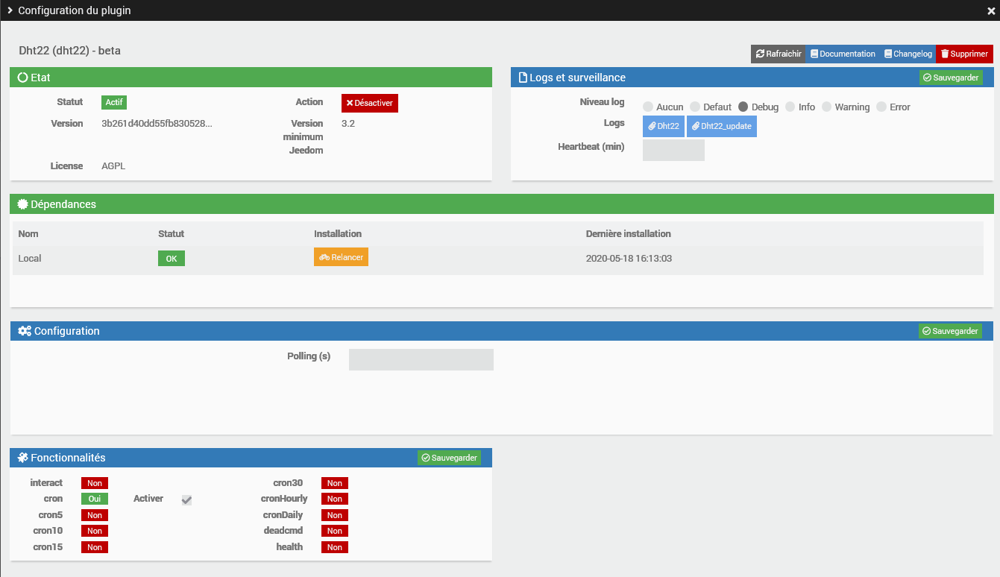
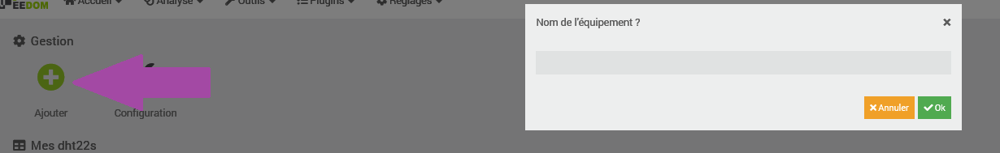
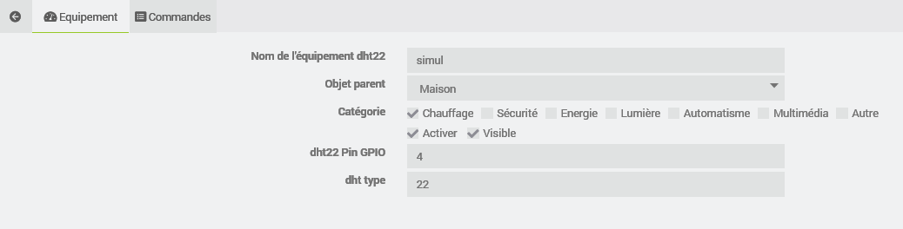
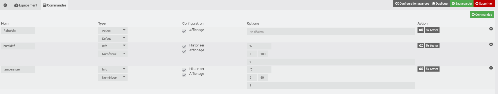

Description
===

Plugin permetant la lecture de plusieurs sondes DHT22 DHT11 sur le GPIO d'un raspberry.

Configurtion du plugin
===

Après téléchargement du plugin, il vous suffits d’activer et d’installer les dépendances ADAFRUIT_DHT22 (clic sur le bouton Installer/Mettre à jour)

La zone configuration polling n'est pour le moment pas active, il n'est donc pas utile de mettre une valeur à polling
Création d'un équippement
===

Cliquez sur ajouter puis donnez lui un nom !

Configuration d'un équippement
===

dans dht pin gpio saissez le GPIO auquel vote sonde est raccordée ici gpio 4 sois la broche 7 du raspberry
dans dht type saississez le type de sonde 
    - 11 pour une sonde DHT11
    - 22 pour une sonde DHT22
    - 22 pour une sonde AM2302

Rappel GPIO

Configuration des commandes
===

Les commandes de l'équipement sont crées automatiquement il ne vous reste plus qu'as saisir les limites min et max, l'unité, et choisir les autres optiion comme l'histrisation des données